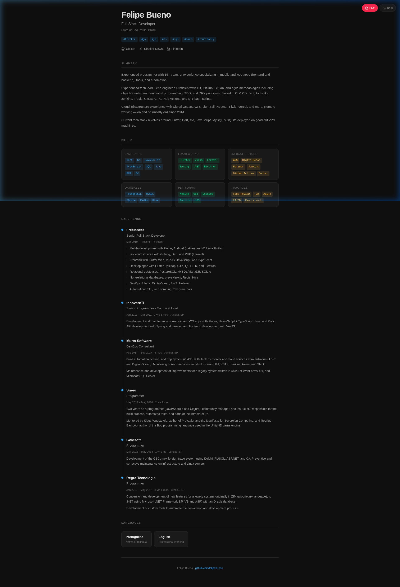
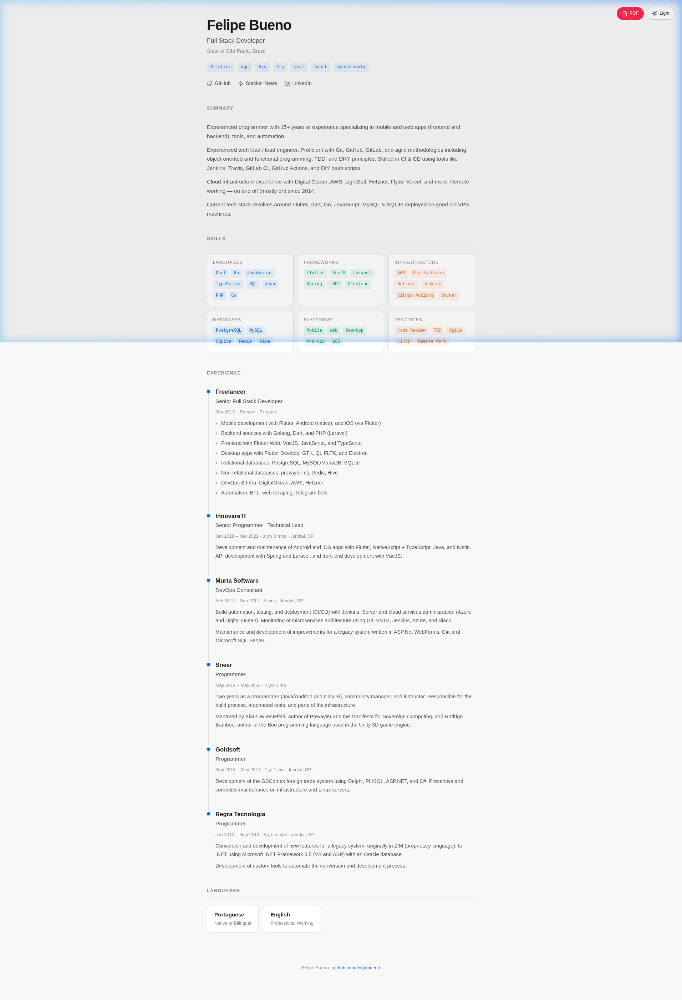

# Felipe Bueno — Resume

Personal online resume built as a single-page static site with **pure HTML & CSS**, no frameworks, no build steps.

🔗 **Live:** [felipebueno.github.io](https://felipebueno.github.io/)

## Features

- Clean, minimal design focused on readability
- Light & dark theme with auto-detection (respects system preference)
- Fully responsive — works on mobile, tablet, and desktop
- Print-optimized styles for PDF export
- Zero dependencies

## Screenshots

| Dark Mode | Light Mode |
|:-:|:-:|
|  |  |

## Tech Stack

Just `index.html` — that's it. Vanilla HTML, CSS, and a tiny bit of JS for the theme toggle.

## License

[MIT](LICENSE)
